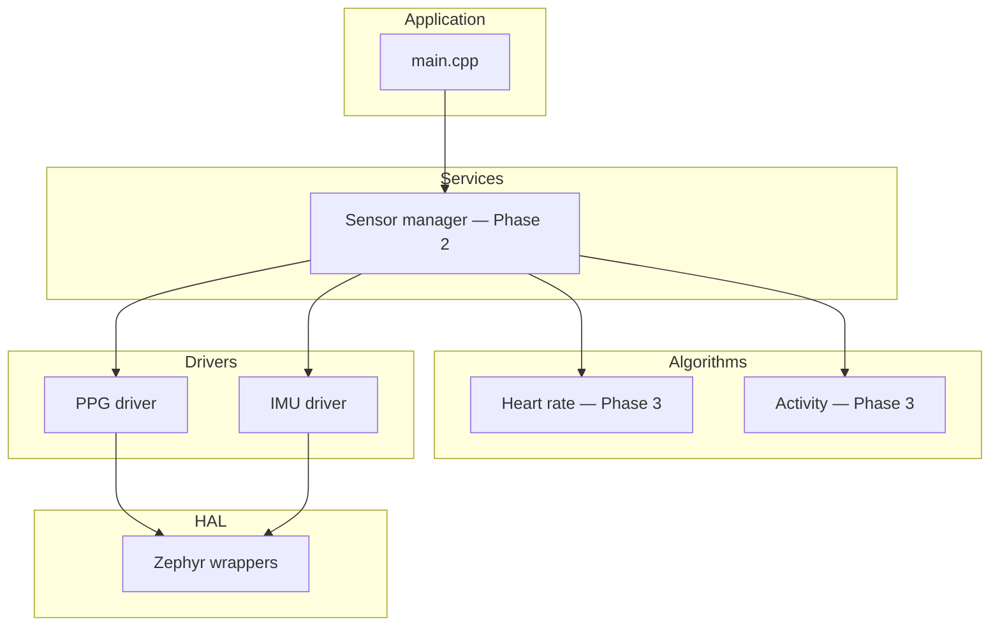

# Wearable Health Monitor (Firmware, simulated)

C++17 firmware for a wrist-worn health monitor, built with **Zephyr RTOS** and run on **ARM Cortex-M3 in QEMU** (`qemu_cortex_m3`). No hardware required for bring-up. **Phase 2** adds `IPpgDriver` / `IImuDriver`, MAX30102 + IMU **skeleton** drivers (no I2C yet), **mock** drivers that replay the same numbers as [`data/ppg_sample.csv`](data/ppg_sample.csv) and [`data/imu_sample.csv`](data/imu_sample.csv), and a **`SensorManager`** that fills Zephyr message queues. **Phase 3** adds **heart-rate** and **activity** algorithms (C++17, no Zephyr in the core math), **GoogleTest** host coverage in [`tests/`](tests/), and small **Python** helpers under [`tools/`](tools/) — see [`docs/architecture.md`](docs/architecture.md).

[](https://github.com/SumedhaUmesh/wearable-health-monitor/actions/workflows/ci.yml)

## Architecture



## Prerequisites

- **Python 3** (3.10+ recommended)
- **CMake** and **Ninja**
- **Zephyr SDK** with the `arm-zephyr-eabi` toolchain (see [Zephyr Getting Started](https://docs.zephyrproject.org/latest/develop/getting_started/index.html))

On macOS you can use Homebrew for CMake/Ninja; install the Zephyr SDK by following the official guide and set `ZEPHYR_SDK_INSTALL_DIR` to the SDK root.

## Clone and workspace setup

This repository is a **West manifest**: Zephyr is fetched next to it, not committed.

```bash
git clone https://github.com/SumedhaUmesh/wearable-health-monitor.git
cd wearable-health-monitor

python3 -m venv .venv
source .venv/bin/activate   # Windows: .venv\Scripts\activate
pip install west

west init -l .
west update
pip install -r zephyr/scripts/requirements.txt
```

Install and register the **Zephyr SDK** (same major line CI uses: **0.16.x**), then:

```bash
west zephyr-export
```

## Build and run (QEMU)

From the repository root:

```bash
west build -b qemu_cortex_m3 -d build .
west build -d build -t run
```

You should see **`[sensor]`**, **`[hr]`**, and **`[act]`** log lines as mock samples flow through queues and algorithms (two-second heartbeat summaries plus BPM / activity when updated).

## Debug

See [**docs/debugging.md**](docs/debugging.md) for GDB + QEMU (`debugserver` + `arm-zephyr-eabi-gdb`).

## Branches: `main` and `develop`

- **`main`**: stable integration; tag releases or milestones here.
- **`develop`**: day-to-day work; open PRs into `develop`, then merge `develop` → `main` when you want a release checkpoint.

Typical flow:

```bash
git checkout main
git pull
git checkout -b develop
git push -u origin develop
```

Feature work:

```bash
git checkout develop
git pull
git checkout -b your-topic-branch
# … commit …
git push -u origin your-topic-branch
```

Open a PR into `develop`. When ready, PR `develop` → `main` or merge locally and push.

## CI

[`.github/workflows/ci.yml`](.github/workflows/ci.yml) runs on pushes and pull requests to **`main`** and **`develop`**:

- **Firmware CI**: West fetch, Zephyr SDK install (cached), `west build -b qemu_cortex_m3`.
- **Host unit tests**: CMake + Ninja + GoogleTest in [`tests/`](tests/) (no Zephyr).

## Host unit tests (algorithms)

From the repo root (no Zephyr needed):

```bash
cmake -S tests -B build-tests -G Ninja
cmake --build build-tests
ctest --test-dir build-tests --output-on-failure
```

## Offline CSV check

```bash
python3 tools/validate.py --imu data/imu_sample.csv
```

## Regenerate IIR coefficients (optional)

Requires SciPy:

```bash
pip install scipy numpy
python3 tools/gen_iir_coeffs.py
```

## Plot sample waveform (optional)

```bash
pip install matplotlib
python3 tools/plot_results.py --ppg data/ppg_sample.csv --out docs/results/ppg_preview.png
```

Commit the PNG if you want it visible on GitHub without regenerating.

## Results (accuracy story)

What is **demonstrated today**:

- **Firmware CI**: reproducible `qemu_cortex_m3` link of this application.
- **Host algorithms**: GoogleTest checks IIR impulse response vs SciPy, coarse BPM from a synthetic sine, and activity classification thresholds on synthetic magnitude streams.

What belongs in an interview narrative once you run offline evaluation:

- **Heart rate**: compare BPM tracks against **PhysioNet BIDMC** (or similar) ECG-derived references; store confusion plots and MAE in [**docs/results/**](docs/results/README.md).
- **Activity**: batch-classify **WISDM** (or exported windows) against labels; report accuracy and confusion matrix under the same folder.

This repo keeps algorithms small and testable; scaling evaluation is intentionally a scripts-and-data exercise, not a second firmware image.

## Future work

- **Hardware**: wire **`Max30102Driver`** / IMU skeleton to real I2C via Zephyr `i2c_dt_spec`, swap mocks at compile-time or factory registration.
- **Radio**: see [**docs/ble_future.md**](docs/ble_future.md) for standard heart-rate GATT notifications.
- **Power**: see [**docs/power.md**](docs/power.md) for measurement-oriented hooks.
- **Renode / advanced simulation**: optional I2C peripheral models once drivers exist.

## Demo checklist (recruiter-facing)

Record a short screen capture showing: clone → `west build` → `west build -t run` (visible **`[sensor]` / `[hr]` / `[act]`** logs) → `cmake`/`ctest` host tests green → GitHub Actions badges green on **`main`**.

## Phase 1 exit criteria

See [**docs/phase1_checklist.md**](docs/phase1_checklist.md).

## License

SPDX-License-Identifier: Apache-2.0 (see `CMakeLists.txt` header).
